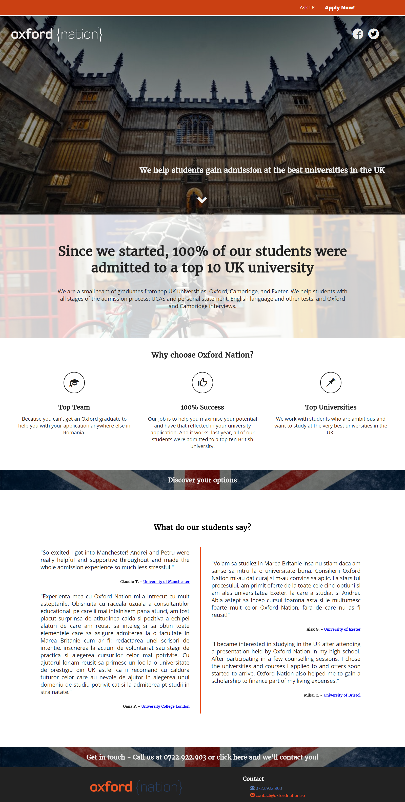

# oxford_nation
This is a website for a an educational counseling business for highschool students looking to study in the UK.
It was the first website I designed and coded, now refactored with various stuff that I've learned (different way to write and organize code, using tools such as Sass or Grunt).
I intend for this to be a practice ground of sorts, more features and refactorings will be added as I learn new technologies and tools.

Desktop version:

Mobile version:

 

